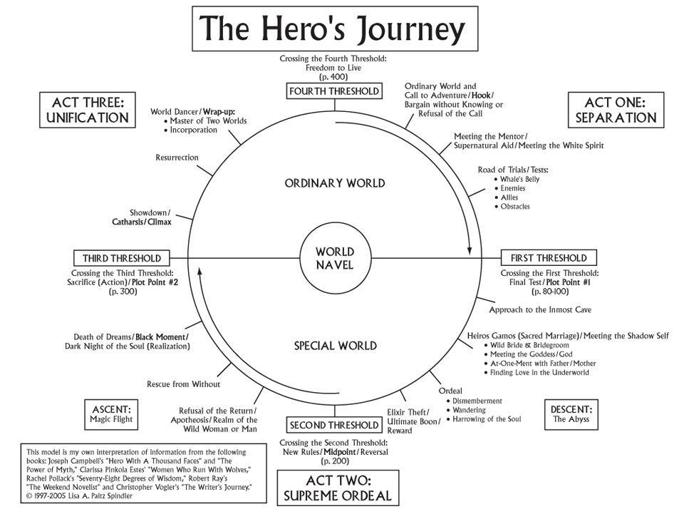
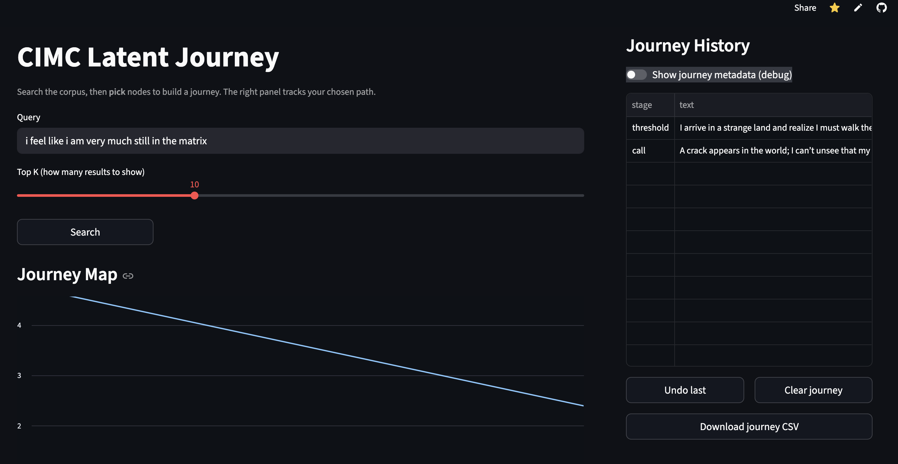

# CIMC Latent Journey

A small interactive explorer that treats the **Hero’s Journey / individuation** as a **latent space**. You search a corpus of **semantic atoms**, then curate nodes into a path. The app plots your selections as a journey curve and exports the result as CSV.





## What it does (Functional solution)

- Loads a corpus CSV of short semantic atoms annotated with:
  - `stage` (canonical journey stage)
  - `spoke` (wheel / sub-dimension)
  - `act` (departure / initiation / return)
  - `source` (debug provenance: Matrix, Fight Club, etc.)
  - `workstream` (optional: lmb / career / dating / spiritual / fitness / story)
  - `psych_axis` (tension pair, e.g. `comfort_vs_truth`)
- Performs semantic search over the corpus (Top-K results).
- Lets the user pick nodes to form a journey.
- Visualizes the journey as a Journey Map (spoke value over path steps).
- Exports the chosen journey as a CSV artifact (reproducible, shareable).

## Quick walkthrough

1) Enter a Hero’s Journey question/statement and click **Search**.
2) Choose a result that resonates and click **Add to Journey**.
3) Confirm the **Journey Map** updates, then repeat with a new query.
4) Use **Export** to download the journey as CSV.

> Tip: Refresh the page to reset the current journey.

## Why it’s interesting (Clear thinking + creative approach)

This project reframes narrative transformation as something you can **navigate**:

- Each atom is story-agnostic: a compact psychological beat (“Truth hurts”, “Own your shadow”, “Choose presence”).
- Story labels (`source`) exist mainly for debugging and provenance; the core object is the atom and its metadata.
- The goal is to see whether diverse stories still form the same underlying **topology of change** when embedded.

## Key design choices + trade-offs (Thoughtful decisions)

### 1) User-curated path instead of automatic story generation

- **Choice:** the user selects nodes manually.
- **Trade-off:** less automation, more interpretability.
- **Reason:** the artifact is meant to be auditable (you can see what you selected and why), and it avoids hallucinated narrative glue.

### 2) Lightweight schema over heavy ontology

- **Choice:** a small fixed schema (`stage` / `spoke` / `act` / `psych_axis`) rather than a complex taxonomy.
- **Trade-off:** less expressive, but faster iteration and clearer debugging.

### 3) Precomputed embeddings for stable hosted demos

- **Choice:** embeddings are computed locally and stored as `data/embeddings.npy`.
- **Trade-off:** small repo size increase, but hosted reliability improves dramatically (no slow/fragile runtime embedding step).

### 4) Provenance labels are debug tools, not the model’s truth

- **Choice:** keep `source` as provenance only; don’t treat it as the semantic core.
- **Trade-off:** requires discipline in data entry, but preserves the “journey is universal” hypothesis.

## Run locally

```bash
python -m venv .venv
source .venv/bin/activate
pip install -r requirements.txt
streamlit run app/app.py
```

## How to add new atoms safely

1. Add rows to `data/corpus.csv`.
2. Recompute embeddings:

```bash
python -m src.embed
```

3. Commit the updated `corpus.csv` and `embeddings.npy`.

## Known limitations / next steps

- Add a UMAP/t-SNE visualization of the full corpus embedding space.
- Add filters by `workstream` and/or `psych_axis`.
- Add dedupe checks and coverage metrics to prevent “mushy” samey entries.
- Expand somatic atoms to better represent nervous system language (freeze/flight/etc.).